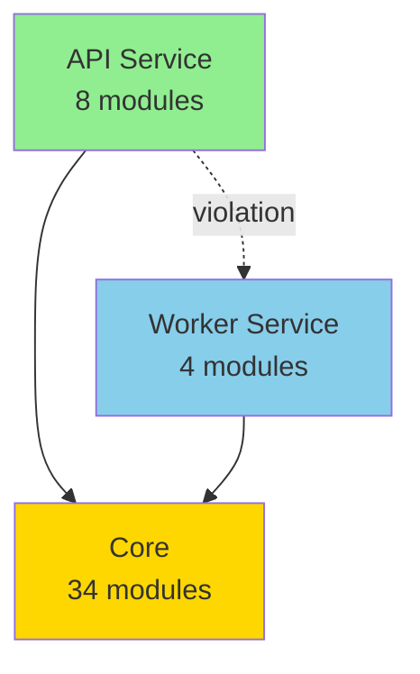

# CodeMap - What Users See

## 1. Basic Scan (`python -m codemap scan .`)

```
============================================================
CodeMap Analysis Summary
============================================================

Files analyzed: 67
Import relationships: 193

Violations found:
  Errors:   9      ← Red flag! Real issues
  Warnings: 0
  Info:     0


ERRORS:
------------------------------------------------------------

[ERROR] worker-cannot-import-api
  File: worker/tasks.py (line 40)        ← Exact location
  Imports: api/models.py                 ← What's wrong
  
  GUARDRAIL VIOLATION: Worker service must not import API code.
  - Worker never imports API code
  - Use database/Redis for all communication
  - Worker reads clients/cases/runs/documents (read-only)
  Reference: CLAUDE.md v0.2.0 Guardrails Architecture
                                         ↑
                                    Your custom message
```

**What the developer gets:**
- ✅ Instant feedback (< 1 second)
- ✅ Exact file and line number
- ✅ Clear explanation of the violation
- ✅ Reference to your architecture docs
- ✅ Zero false positives

---

## 2. Statistics View (`python -m codemap stats .`)

```
============================================================
CodeMap Statistics: Legal Events Production
============================================================

Total Python files: 67
Total imports: 193
External dependencies: 73

Services:
------------------------------------------------------------

api:
  Modules: 8                    ← Size of each service
  Outgoing imports: 14          ← Dependencies it creates
  Incoming imports: 22          ← How coupled it is

core:
  Modules: 34
  Outgoing imports: 128
  Incoming imports: 124

worker:
  Modules: 4
  Outgoing imports: 13          ← Worker has 13 dependencies
  Incoming imports: 2           ← Only 2 things depend on it


Top External Dependencies:
------------------------------------------------------------
  - anthropic
  - docling
  - fastapi
  - sqlalchemy
  - redis
  ... and 68 more
```

**What the developer learns:**
- 📊 Codebase structure at a glance
- 📈 Which services are most coupled
- 🔗 What external libraries you use
- 🎯 Where to focus refactoring

---

## 3. CI/CD Validation (`python -m codemap validate .`)

```
============================================================
CodeMap Analysis Summary
============================================================

Files analyzed: 67
Import relationships: 193

Violations found:
  Errors:   9
  Warnings: 0
  Info:     0


ERRORS:
------------------------------------------------------------
... (same as scan output) ...

✗ Validation failed      ← Exit code 1 (fails CI/CD build)
```

**What happens in CI/CD:**
- ❌ Build fails if violations found
- ✅ Build passes if clean
- 🔧 Can configure to fail only on errors (not warnings)
- 📝 Full report in CI logs

---

## 4. Verbose Mode (`python -m codemap scan . --verbose`)

```
Using config: /Users/aks/legal-events-production/.codemap.yaml

Scanning: /Users/aks/legal-events-production

Parsed 67 files
  (0 files had parse errors)

============================================================
CodeMap Analysis Summary
============================================================
... (standard summary) ...

Service Breakdown:         ← Extra details
------------------------------------------------------------

api:
  Modules: 8
  Imports from this service: 14
  Imports to this service: 22

core:
  Modules: 34
  Imports from this service: 128
  Imports to this service: 124

worker:
  Modules: 4
  Imports from this service: 13
  Imports to this service: 2
```

---

## 5. Clean Project (No Violations)

```
============================================================
CodeMap Analysis Summary
============================================================

Files analyzed: 45
Import relationships: 120

Violations found:
  Errors:   0
  Warnings: 0
  Info:     0

✓ No violations found!        ← Green checkmark!

============================================================
```

---

## 6. Multiple Severities

If you had warnings configured:

```
Violations found:
  Errors:   2      ← Must fix
  Warnings: 5      ← Should fix
  Info:     3      ← Nice to fix


ERRORS:
------------------------------------------------------------
[ERROR] api-cannot-import-worker
  File: api/routes.py (line 12)
  ...

WARNINGS:
------------------------------------------------------------
[WARNING] prefer-absolute-imports
  File: worker/tasks.py (line 5)
  Pattern: from .. import utils
  Prefer absolute imports over relative imports.

[WARNING] shared-no-service-deps
  File: core/utils.py (line 8)
  ...
```

---

## What Makes This Useful?

### For Developers
1. **Instant feedback** - Know immediately if you broke rules
2. **Clear guidance** - Exact location and fix suggestion
3. **No noise** - Only real issues, zero false positives
4. **Fast** - Runs in 1 second

### For Teams
1. **Enforces architecture** - Rules are checked, not just documented
2. **Onboarding** - New devs see structure immediately
3. **Technical debt** - Quantify coupling and complexity
4. **CI/CD integration** - Catch violations before merge

### For Architects
1. **Visualize structure** - Stats show actual dependencies
2. **Validate design** - Ensure boundaries are respected
3. **Track metrics** - Module counts, coupling, external deps
4. **Config-driven** - Change rules without changing code

---

## Future Visualizations (Phase 2)

When we add HTML/Mermaid output, users will also see:

### Interactive Dependency Graph
```
     ┌─────────┐
     │   API   │ (green)
     └────┬────┘
          │
          ├──────> Core (gold)
          │
          └─[✗]──> Worker (blue) ← Red line = violation!
                   
     ┌─────────┐
     │ Worker  │
     └────┬────┘
          │
          └──────> Core
```

**Click on nodes to:**
- See file list
- View code snippet
- Jump to violations
- Filter by service

### Mermaid Diagram (in Markdown)


**Embeds in:**
- GitHub README
- Confluence docs
- Notion pages

---

## Commands Cheat Sheet

```bash
# Daily development
python -m codemap scan .                # Check for violations
python -m codemap scan . --verbose      # Detailed breakdown

# Understanding codebase
python -m codemap stats .               # Architecture overview

# CI/CD pipeline
python -m codemap validate .            # Fail build if errors
python -m codemap validate . --strict   # Fail on warnings too

# New project setup
python -m codemap init                  # Create .codemap.yaml template
```

---

## Real Example: Your Violations

Running on legal-events-production found:

**Problem:** `worker/tasks.py` line 40:
```python
from api.models import Run, RunStatus, Document  # ← VIOLATION!
```

**Why it's bad:** Worker importing API breaks your microservice boundaries

**How to fix:**
1. Move `api/models.py` → `core/models.py`
2. Both API and Worker can import from Core
3. Re-run: `python -m codemap scan .`
4. ✅ Validation passes

**Impact:** Enforces v0.2.0 guardrails automatically!
