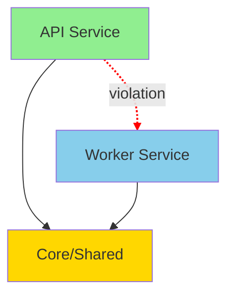

# CodeMap - Detailed Design

## Problem Statement

Many codebases have architectural rules and boundaries that are documented but not enforced:
- Microservices shouldn't import each other directly
- Layers (UI → Service → Data) should respect boundaries
- Shared code shouldn't depend on specific services
- Certain modules should only use approved libraries

**Challenge**: How do we validate custom architectural rules and visualize structure across ANY Python project?

## Solution: Configurable Static Analysis + Universal Visualization

**Key Insight**: Make the tool project-agnostic with user-defined rules via config files.

## Architecture

### 1. Parser Module (`parser.py`)

**Responsibility**: Extract code structure using Python's AST

**Input**: Directory path (e.g., `api/`, `worker/`, `core/`)

**Output**: 
```python
{
    "file": "api/routes.py",
    "imports": ["core.event_extractor_catalog", "api.storage"],
    "classes": ["ClientAPI", "CaseAPI"],
    "functions": ["get_client", "create_case"],
    "calls": ["queue.enqueue('worker.tasks.process_run')"]
}
```

**Key Functions**:
- `parse_file(filepath)` → AST analysis
- `extract_imports(ast_tree)` → Import statements
- `extract_definitions(ast_tree)` → Classes/functions
- `extract_calls(ast_tree)` → Function calls

**Technology**: `ast` module (Python stdlib)

### 2. Config Loader (`config.py`)

**Responsibility**: Load and parse `.codemap.yaml` configuration

**Configuration Schema**:
```yaml
project:
  name: "My Project"
  root: "."
  exclude: ["venv/**", "node_modules/**", "*.pyc"]

services:
  - name: api
    paths: ["api/**/*.py"]
    color: "#90EE90"
  - name: worker
    paths: ["worker/**/*.py"]
    color: "#87CEEB"

rules:
  - name: no-cross-service-imports
    severity: error
    from: "api/**/*.py"
    cannot_import: "worker/**/*.py"
    message: "Services should not import each other"
  
  - name: layer-violation
    severity: warning
    from: "ui/**/*.py"
    cannot_import: "data/**/*.py"
    message: "UI should not access data layer directly"
```

**Key Functions**:
- `load_config(path)` → Parse YAML
- `validate_config(config)` → Check schema
- `get_default_config()` → Sensible defaults if no config

### 3. Graph Builder (`graph.py`)

**Responsibility**: Build relationship graph from parsed data + config

**Data Structure**:
```python
graph = {
    "nodes": [
        {"id": "api.routes", "type": "module", "service": "api", "path": "api/routes.py"},
        {"id": "worker.tasks", "type": "module", "service": "worker", "path": "worker/tasks.py"},
        {"id": "core.extractor", "type": "module", "service": "shared", "path": "core/extractor.py"}
    ],
    "edges": [
        {"from": "api.routes", "to": "core.extractor", "type": "import", "line": 12},
        {"from": "api.routes", "to": "worker.tasks", "type": "import", "line": 15, "violation": "no-cross-service-imports"}
    ]
}
```

**Key Functions**:
- `build_graph(parsed_files, config)` → Create node/edge structure
- `classify_service(filepath, config)` → Match against config service patterns
- `match_pattern(filepath, pattern)` → Glob pattern matching

### 4. Analyzer (`analyzer.py`)

**Responsibility**: Detect architectural violations based on user-defined rules

**Key Functions**:
- `check_rules(graph, config)` → Apply all rules from config
- `match_rule(edge, rule)` → Check if edge violates rule
- `categorize_violations(violations)` → Group by severity/type
- `generate_report(violations)` → Format for output

**Rule Matching Logic**:
```python
def check_import_rule(edge, rule):
    """
    Check if import edge violates a 'cannot_import' rule
    
    edge: {"from": "api/routes.py", "to": "worker/tasks.py", "type": "import"}
    rule: {"from": "api/**/*.py", "cannot_import": "worker/**/*.py"}
    """
    if not matches_pattern(edge["from"], rule["from"]):
        return None  # Rule doesn't apply
    
    if matches_pattern(edge["to"], rule["cannot_import"]):
        return {
            "rule": rule["name"],
            "severity": rule["severity"],
            "file": edge["from"],
            "imported": edge["to"],
            "line": edge["line"],
            "message": rule["message"]
        }
    
    return None  # No violation
```

**Extensible Rule Types**:
- `cannot_import`: Block specific import patterns
- `must_import`: Require certain dependencies
- `max_dependencies`: Limit coupling
- `pattern`: Regex-based code pattern matching
- `custom`: Python function for complex rules

### 5. Visualizer (`visualizer.py`)

**Responsibility**: Generate human-readable output (format-agnostic)

**Outputs**:

**A. Mermaid Diagram** (with config-based colors):


**B. HTML Report**:
- Interactive force-directed graph (D3.js or similar)
- Violations highlighted in red
- Click nodes to see code snippet
- Filter by service/violation type

**C. Terminal Output**:
```
CodeMap Analysis Report
=======================

Services Found:
  ✓ API (15 modules)
  ✓ Worker (8 modules)
  ✓ Core (35 modules)

Guardrails Violations:
  ✗ api/routes.py imports worker.tasks (line 12)
  ✗ worker/processor.py imports api.storage (line 45)

Dependencies:
  API → Core: 23 imports
  Worker → Core: 18 imports
  API ⇄ Worker: 2 violations ⚠️
```

### 6. CLI (`main.py`)

**Responsibility**: Command-line interface (project-agnostic)

**Commands**:
```bash
# Scan any project
python -m codemap scan /path/to/project

# Use custom config
python -m codemap scan . --config my-rules.yaml

# Initialize config for new project
python -m codemap init  # Creates .codemap.yaml template

# Validate (CI/CD)
python -m codemap validate --strict

# Generate visualizations
python -m codemap visualize --format mermaid > diagram.md
python -m codemap visualize --format html --output report.html

# Interactive web UI
python -m codemap serve --port 8080

# Export graph data
python -m codemap export --format json > graph.json
```

**Config Auto-Detection**:
1. Check for `.codemap.yaml` in project root
2. Check for `codemap.yaml` in project root
3. Check for `~/.codemap.yaml` (global defaults)
4. Use built-in defaults if none found

## Implementation Plan

### Phase 1: Core Parser (Day 1)
- [x] Design complete
- [ ] `parser.py` - Basic AST parsing
- [ ] `graph.py` - Simple graph builder
- [ ] Test on `api/` and `worker/` directories

### Phase 2: Guardrails Analyzer (Day 1-2)
- [ ] `analyzer.py` - Violation detection
- [ ] Define guardrails rules
- [ ] Terminal output formatter

### Phase 3: Visualization (Day 2-3)
- [ ] `visualizer.py` - Mermaid generation
- [ ] Basic HTML template
- [ ] CLI integration

### Phase 4: Polish (Day 3+)
- [ ] Add tests
- [ ] Documentation
- [ ] CI/CD integration script
- [ ] Optional: Interactive web UI

## Technical Decisions

### Why Python AST over regex?
- More accurate (understands Python syntax)
- Can handle complex imports (from X import Y as Z)
- Access to line numbers and context

### Why Mermaid over Graphviz?
- Markdown-friendly (embeds in docs)
- GitHub renders it natively
- Simpler syntax
- Can upgrade to D3.js later

### Why YAML config over Python?
- Non-programmers can define rules
- Safer (no arbitrary code execution)
- Easier to version control and share
- Standard format

### Why not use existing tools?
- **pydeps**: Package-level only, no custom rules
- **snakefood**: Unmaintained, complex setup
- **archunit-python**: Too heavyweight, Java-inspired
- **import-linter**: Close, but less flexible visualization
- **Custom solution**: Full control, tailored to our needs

## Comparison to Similar Tools

| Feature | CodeMap | import-linter | pydeps | snakefood |
|---------|---------|---------------|--------|-----------|
| Custom rules | ✅ YAML | ✅ INI | ❌ | ❌ |
| Visualization | ✅ Multiple | ❌ | ✅ Graphviz | ✅ Graphviz |
| Cross-project | ✅ | ✅ | ✅ | ✅ |
| Interactive UI | ✅ Planned | ❌ | ❌ | ❌ |
| Maintained | ✅ | ✅ | ⚠️ | ❌ |
| Severity levels | ✅ | ✅ | ❌ | ❌ |

## Example Output

For the current codebase violation (if any):
```
⚠️  VIOLATION DETECTED

File: api/routes.py
Line: 12
Issue: Direct import of worker module

  10 | from core.event_extractor_catalog import get_extractor
  11 | from api.storage import get_db
> 12 | from worker.tasks import process_run  # ⚠️ VIOLATION
  13 | 

Guardrail: API service must not import worker code
Solution: Use string-based RQ enqueue: queue.enqueue('worker.tasks.process_run')
```

## Future Enhancements

1. **Data Flow Tracing**: Track how data moves through Redis queues
2. **Database Access Map**: Who reads/writes which tables
3. **Hot Spots**: Identify most imported modules
4. **Complexity Metrics**: Cyclomatic complexity, depth of inheritance
5. **Change Impact**: "If I change this, what breaks?"
6. **AI Annotations**: Use LLM to explain what each module does (like Windsurf)

## Success Metrics

- ✅ Detects all cross-service import violations
- ✅ Generates report in < 5 seconds
- ✅ Zero false positives on guardrails rules
- ✅ Can run in CI/CD pipeline
- ✅ Useful for new developer onboarding
