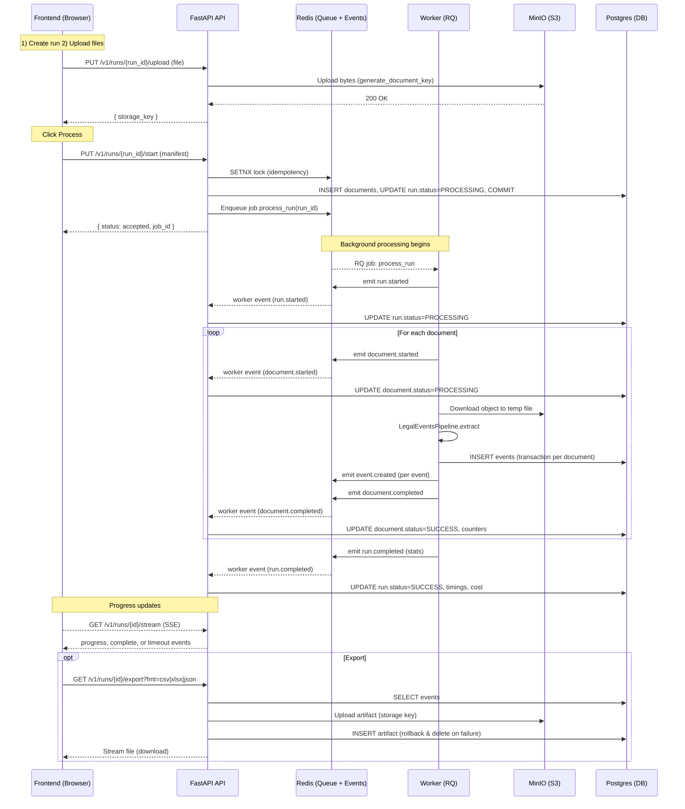

# Run Processing Flow

This diagram shows the end-to-end flow after files are uploaded and you click the Process button.

Key behaviors
- Idempotency lock prevents concurrent duplicate starts for the same key and caches the accepted response for 24h.
- Worker never mutates run/document state directly; it emits events that the API consumes to update state.
- Event inserts are transactional per document to avoid partial persistence.
- SSE stream provides periodic progress updates and a final completion event.
- Export uploads the artifact to S3 and rolls back the object if the DB insert fails.

